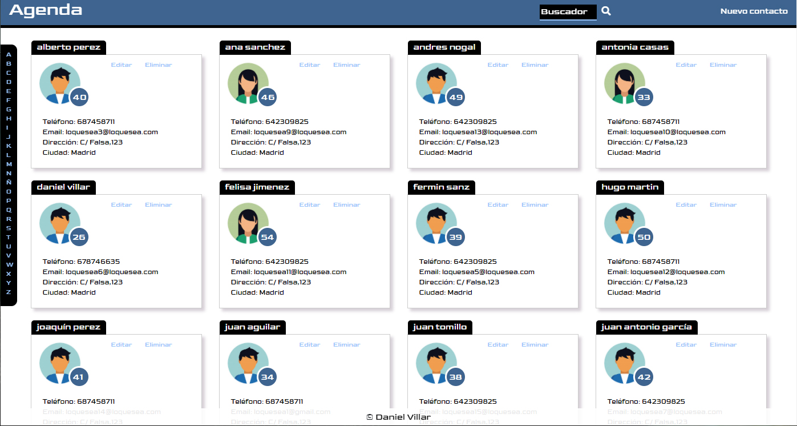

# Agenda de contactos

## Descripción

Aplicación de agenda de contactos. El usuario puede agregar usuarios, modificar sus datos y eliminarlos. Incorpora un menú lateral que muestra los contactos por la inicial del nombre y un buscador en el cual se puede filtrar por nombre también.

La aplicación sigue los principios del diseño responsive, está en formato ordenador y móvil. Las tarjetas de usuario muestran una imagen diferente en función del sexo del usuario. Los datos se almacenan en un array de objetos. Primeros pasos en JS, SCSS y Bootstrap.

## Caracerísticas

* HTML5, CSS3, JS
* SASS
* [Bootstrap]( https://getbootstrap.com/)
